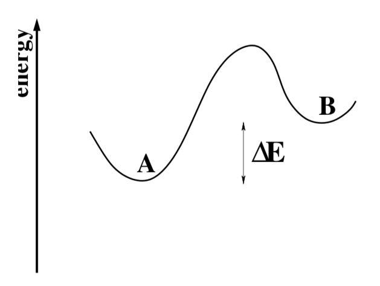

```javascript
%%javascript
MathJax.Hub.Config({
    TeX: { equationNumbers: { autoNumber: "AMS" } }
});
```


    <IPython.core.display.Javascript object>


## MSE 215: Computational Materials Science, Spring 2019
## Department of Materials Science and Engineering | University of California, Berkeley

### Instructor: Dr. Matthew Sherburne, Graduate Student Instructor: John Dagdelen
#### Project designed by Prof. Daryl C. Chrzan

##  Project 4: Monte Carlo (Due May 3, 11:59PM)

## Introduction
Welcome to your Monte Carlo Laboratory Assignment. In this laboratory
assignment, you will apply the Metropolis algorithm to compute the
properties of a 2D Ising models.

In lecture, I tried to convince you that if one considers a system
in contact with a heat reservoir, that the probability of finding the
system in a {\em particular} 
microstate with energy $E$ is given by the canonical
distribution:
\begin{equation}
P(E) = \frac{\exp({-\beta E})}{Z}
\label{prob}
\end{equation}
with $\beta = 1/k_B T$, $k_B$ defined to be Boltzmann's constant,
and $T$ the temperature.
The constant of proportionality, $Z$, is 
known as the partition function, and is givenby

\begin{equation}
Z = \sum_{\mbox{all microstates}} \exp({-\beta E}) \,\, .
\label{part}
\end{equation}

Armed with  expression (\ref{prob}),
one can calculate the expected result for measurement of
any experimental parameter, provided one can perform the sum.

In general, one \emph{cannot} perform the sum.  There are simply
too many microstates to consider.  At first blush, it appears that
we are sunk - if we can't calculate the sum contained in
Eq. (\ref{part}), 
how can we hope to evaluate expectation values for the total energy,
for example?

Well, it turns out that we can get high quality estimates for the various
parameters because of the simple fact that $P(E)$, the probability to
find our experimental system in a microstate with energy $E$ is a sharply peaked
function of the energy.  (Note that there is more than one accessible
microstate with energy $E$.) Hence it is not
necessary to evaluate the contributions from every microstate.  Rather,
we only to need to consider the contributions from the "important"
microstates.

The question then arises, if we don't have to look at all of the microstates,
how do we choose microstates such that the "important" states occur more
frequently, as suggested by Eq. (\ref{prob})?  
A quick analysis provides the answer.

Let's label all of the microstates with the subscript $n$.  Then, let 
$P_n(t)$ be the probability that the system is in the $n$th microstate
at time $t$.  We define $\Gamma_{n,n'}$ to the rate at which microstate
$n$ becomes microstate $n'$.  Then one can write a set of equations,
the so-called master equations, for the time evolution of the probabilities:

\begin{equation}
\frac{d P_n(t)}{dt} = \sum_{n'} \left \{ 
\Gamma_{n',n} P_{n'}(t) - \Gamma_{n,n'}P_{n}(t) \right \} \,\,.
\label{master}
\end{equation}

This equation just expresses the fact that the system can only transform
between microstates - the probability is hence
conserved.  Now at equilibrium, the $P_n(t)$ should all be
constant.  (Otherwise, the system is not at equilibrium.)  The left hand 
side of Eq. (\ref{master}) must be identically zero and 
the transition rates can (and must) be taken to
satisfy:

\begin{equation}
\frac{\Gamma_{n',n}}{\Gamma_{n,n'}} = \frac{P_n(t)}{P_{n'}(t)} \,\,.
\label{det_balance}
\end{equation}

*(Newman and Burkema discuss this point in their book {\em Monte Carlo Methods in Statistical Physics} (Clarendon Press, Oxford, 2001), ISBN: 0 19 851797 1.)*
  
If we define the energy of the $n$th microstate to be $E_n$, then it is simple
to show, through the use of Eqs. (\ref{prob}) and (\ref{part}) that
the right hand side of Eq. (\ref{det_balance}) is given simply by
$\exp(-\beta \Delta E)$, with $\Delta E = E_{n'}-E_n$.  Hence at
equilibrium, the transition rates satisfy:

\begin{equation}
\Gamma_{n',n}  =\Gamma_{n,n'} \exp\left (-\beta [E_{n}-E_{n'}] \right ) \,\,.
\label{rates}
\end{equation}

The diagram in Fig. 1 should help to clarify the physics a bit.
From the figure, it is clear that the rates behave in the manner you
would expect.


*Figure 1: A schematic diagram of the energy as a function of some unnamed reaction coordinate.  Eq. (\ref{rates}) states that, at equilibrium, the transition rate from state A to state B is slower than the transition rate from B to A by a factor of $\exp\left (-\beta \Delta E \right ) $.* 

The crux of the matter is thus the following.  At equilibrium, we know 
the relative rates at which one state transitions into another.  It can
be shown that if we establish transition
rates that obey Eq. (\ref{det_balance}),
then our system will eventually reach the true equilibrium state.
While in the equilibrium state, the system will explore each of its
microstates  according to the probability distribution of Eq. (\ref{prob}).
\emph{That is, if we choose rates obeying Eq. (\ref{det_balance}),
the microstates of the ensemble will {\bf automatically} be 
visited in proportion to their weighting in
the probability distribution of Eq. (\ref{prob}). This choice of rates
assures the importance sampling we seek!} 

Armed with this knowledge, we can begin to explore the larger scale properties
of an atomic scale model by merely calculating the average of
the desired observable over the microstates generated by the
transition rates in Eq. (\ref{rates}) . The approach which suggests itself is the
following.

1. Develop a description of the energetics for the system in question.
For a magnetic system, one might develop an expression for the total energy
much like that we discussed in class.

2. Develop an algorithm for transitions between microstates.  Make sure
that the algorithm obeys detailed balance.

3. Evolve the system according to the dynamics you have developed for some
fixed "time".

4. Calculate the value
of the desired experimental observable and record it. 
 
5. Return to step 3 as often as "necessary."

6. Once you have sufficient data, calculate the average of the recorded values. This is the approximation to the ensemble average you seek.


A comment is in order.  The dynamics we assume are just that,
**assumed**.  The time steps do not necessarily correspond to 
steps in "real" time. Referring to Fig. 1, for example, we note that the
relative transition rates between states A and B is determined by $\Delta E$
(and the value of $\beta$),
whereas the absolute rates will necessarily reflect the energy barrier
shown in the figure.
Second, by choosing dynamics that obey Eq. (\ref{det_balance}) we are
assured of approaching the equilibrium state.  However, it is not obvious that
a "real-world" system obeys Eq. (\ref{det_balance}) under all circumstances.
In principle, the transition rates could depend upon the configuration. 
Hence the evolution from a nonequilibrium state
towards equilibrium may not be modelled well based on the assumed dynamics.
One is really only certain to be able to address equilibrium properties.
So as is true with all simulation methodologies, \emph{caveat emptor}.

### Simple model for a binary alloy

Suppose that we wish to study the properties of a simple 2D alloy.
For simplicity, we will restrict the atoms to reside on the sites of a
simple square lattice.  We consider a system that has two types of
atoms: A and B.  Finally, we compute the energy in the system by
summing over nearest neighbor bonds.  For example, a bond between two
A atoms has and energy $\varepsilon_{AA}$.  Similarly, a bond between
two B atoms has the energy $\varepsilon_{BB}$.  Finally, a bond
between an A atom and a B atom has the energy $\varepsilon_{AB}$.

We define a variable $\sigma_{i,j}=\pm 1$ at each site of the lattice,
$i,j$.  The site occupation variables are defined by:

\begin{eqnarray}
n_A(i,j)&=&\frac{1}{2}\left ( 1+\sigma_{i,j} \right ) \\
n_B(i,j)&=&\frac{1}{2}\left ( 1-\sigma_{i,j} \right ) , \nonumber
\end{eqnarray}

where $n_A(i,j)$ and $n_B(i,j)$ are the number of A and B atoms,
respectively, at site $i,j$.

Using the definitions above, the total energy of the alloy can be
written in terms of the $\sigma_{i,j}$'s (to within an overall constant
that is physically unimportant):

\begin{equation}
E_{total}=-J\sum_{i=0}^{L-1}\sum_{j=0}^{L-1} \left (\sigma_{i,j}
  \sigma_{i,j+1}+\sigma_{i,j} 
  \sigma_{i+1,j} \right )-H\sum_{i=0}^{L-1} \sum_{j=0}^{L-1} \sigma_{i,j}, \label{2DIsing}
\end{equation}

with $J=\left ( 2 \varepsilon_{AB}-\varepsilon_{AA}-\varepsilon_{BB}
\right )/4$, and $H=\left (\varepsilon_{BB}-\varepsilon_{AA} \right)$. We will assume periodic boundary conditions so that the index $i=L$
corresponds to $i=0$ and the index $i=-1$ corresponds to the index
$i=L-1$, etc.  Note that if $J>0$, or equivalently, if
$\varepsilon_{AA}+\varepsilon_{BB}<2 \varepsilon_{AB}$, the model
corresponds to a ferromagnet or phase separating alloy.  If $J<0$,
then the model yields an antiferromagnet or an ordering alloy.
Similarly, if $H>0$, the model favors atoms of type A.

The model described in Eq. (\ref{2DIsing}) is known as the 2D Ising
Model.   It holds a unique place in the history of statistical
mechanics, as it is, perhaps, the simplest exactly solved statistical mechanics
model that displays a finite temperature phase transition. In what
follows, we will interpret the model as that for a ferromagnet.
In doing so, we will avoid some subtleties associated with
interpreting the model as an alloy. 

### Metropolis algorithm for the 2D Ising model

I think that the best way to understand  Monte Carlo techniques
is to implement one, and that is what you will do. You can code the
model in your own favorite programming language, but the code must be
yours - do not simply find one on the web.   I suggest using either
Matlab or Mathematica, but you are free to use whatever language you
want, as long as there are sufficiently sophisticated math libraries
that include a good random number generator, and, perhaps, functions
for computing correlations. A word of caution, though.  Monte Carlo simulations
can require substantial computer resources to produce reliable
results.  Keep this in mind when choosing your computational
platform.

So, we will calculate the properties of the 2-D Ising model using
Monte Carlo simulation methods.  We have already taken the first step in
this endeavor - we've developed an expression for the energy of the
microstates.  The next step is the development of an algorithm which
insures that Eq. (\ref{rates}) is obeyed at all times.

The algorithm we are about to discuss was developed by Metropolis and
coworkers in 1953, and hence is known
as the Metropolis algorithm (see original paper posted on the bcourses
site).  The steps taken are the following.

1. Establish an initial configuration of moments. One may give the moments
random (with respect to up or down) orientations, 
or one may start with some predetermined configuration.

2. Select a moment within the lattice at random.  Compute the
  change in energy associated with flipping the spin, $\Delta E \left
    ( \sigma_{i,j}\rightarrow -\sigma_{i,j} \right )$.

3. If $\Delta E \leq 0$, \emph{i.e.} the energy decreases upon
  flipping the moment, ''accept'' the change.  That is, assume that
  the next microstate in the Monte Carlo trajectory is the one you
  generated by flipping the spin.  If $\Delta E > 0$, ''accept'' the
  new configuration with a probability given by $\exp (-\beta \Delta
  E)$.  This can be accomplished by generating a random number $\eta$,
  and comparing it with $\exp (-\beta \Delta E)$.  If $\eta <\exp
  (-\beta \Delta E)$ accept the new configuration as the next in the
  trajectory, otherwise, keep the original configuration as the next
  in the trajectory.

4. Compute quantities of interest for this step in the trajectory.
  You will want to compute the magnetization and the total energy at
  each step.

5. Repeat from step 2 as often as ''necessary.'' 

6. Analyze the results of the simulation.

This procedure sounds simple enough, and in fact, it is. But there are
significant details that need to be addressed.  For example, though
the dynamics we employ assuredly take the system to equilibrium, the
initial configuration of spins is typically far from equilibrium.  It
is necessary, therefore, to run a number of steps before assuming that
the microstates correspond to those associated with the equilibrium
distribution.  Unfortunatley, estimating the number of steps required
to equilibrate is non-trivial (though we discuss this below).  

### ''random'' numbers
Random numbers lie at the heart of our Monte Carlo enterprise.  There
is one obvious difficulty, however.  Computers are deterministic -
given a specific code, the same input always produces the same output
(in this case we include as inputs things that the code might read
from a clock etc.)  So numbers generated by a computer are {\em never}
truly random.

However, given the importance of generating apparently random numbers,
the coding and mathematics communities have put some effort into
generating numbers that for our intents and purposes appear random.
The details of the most advanced methods are beyond the scope of this
course.  However, we can describe the simple random number generators
that were used in times passed, and note that modern instances retain
some similarities.

Basically, the generation of random numbers is accomplished through 
a discrete mapping. According to the authors of
*Numerical Recipes*,\footnote{William H. Press, Saul A. Teukolsky, William T. Vetterling, and Brian P. Flannery, \emph{Numerical Recipes: The Art of Scientific Computing}, Third Edition, 2007 Cambridge University Press, ISBN-10: 0521880688.}  a typical mapping appears like this:

\begin{equation}
 I_{j+1} =\mbox{mod}(a I_j,m)
\end{equation}

where the function mod is used to return the remainder of the first argument
divided by the second.  The result of this calculation is an integer between
0 and $m-1$, inclusive.  Note that these numbers are necessarily
periodic - at most,
one can generate one of m possible answers.  It turns out that the quality of
the random number generator is determined by the values chosen for $a$ and for
$m$.  According to Park and Miller\footnote{S. K. 
Park and K. W. Miller, \emph{Communications of the ACM} \underline{31}, 
1192 (1988), as quoted in 
\emph{Numerical Recipes}.} the optimal choice for 32 bit
machines is $a=16807$ and $m = 2^{31}-1 = 2147483647$.

Modern random number generators are much more sophisticated, but most
still rely on a seed and are periodic (at least in principle ... the
periods are so large that one cannot typically verify this directly).

In our work then, we will assume that you will use the best random
number generator available to you, and that this random number
generator will be sufficiently sophisticated so as to produce a string
of reliably random numbers for our simulations. This is certainly true of the
random number generators in Matlab and Mathematica.

### finite size effects

Throughout our discussion of statistical mechanics we have assumed
that our experimental system has an enormous number of degrees of
freedom.  In conducting Monte Carlo simulations, we are constrained by
computational resources to consider systems with only a relatively
small number of degrees of freedom.  It is natural then, to consider
what effect, if any, the finite size of our simulation might have on
our predictions.

In this respect, the physics of the phase transition in the 2D Ising
model is of interest.  First we note that at high temperatures, the
magnetization of the model should approach zero.  At these
temperatures, thermal fluctuations become significant, and the spins,
in general, become quite disordered.  Another way to see this is to
examine the algorithm that we discussed above.  As
$T\rightarrow\infty$, $\beta\rightarrow 0$.  The result is that the probability
to accept any spin flip goes to $1$, and the thermodynamic average of
any spin approaches zero as well.

As the temperature is reduced from $\infty$, spin flips that increase
the energy are accepted with a reduced probability.  Thus spins will
begin to align with their neighboring spins (for a ferromagnetic
interaction) and domains in which the spins are aligned will become
apparent. At higher temperatures, these domains will be small, and
will fluctuate quite rapidly in time.  However, as the temperature is
decreased, the domain size will, in fact, increase.  Eventually, at a
critical value of the temperature known as $T_c$, the domain size will
diverge.  The temperature demarcates the temperature boundary of the
phase transition to the ferromagnetic phase.  Below $T_c$, the system
will display ferromagnetism.  Above $T_c$, the system is a paramagnet.

The domain size can be explored mathematically.  Define the spin-spin
correlation, $g_{\sigma}(\Delta_i,\Delta_j)$, to be:

\begin{equation}
g_{\sigma}(\Delta_i,\Delta_j)=\frac{\langle
  \sigma_{i+\Delta_i,j+\Delta_j}\sigma_{i,j} \rangle -\langle
  \sigma_{i,j} \rangle^2 }{\langle
  \sigma_{i,j}^2  \rangle -\langle
  \sigma_{i,j} \rangle^2 }
\end{equation}

where $\langle A \rangle$ denotes the thermodynamic average of the
quantity $A$.  Briefly, this function measures the
response of the system to perturbations. More specifically, if you
were to perturb a system at the origin, say by holding it fixed in the
up position, this function measures how strongly this perturbation is
felt at the point $\Delta_i,\Delta_j$.  Typically, we expect that
$g_{\sigma}(\Delta_i,\Delta_j) \sim \exp \left (
  -\sqrt{\Delta_i^2+\Delta_j^2}/\xi \right )$, with $\xi$ the
correlation length.  This correlation length serves as a good measure
of the domain size the model.

The problem with finite sized systems, then, becomes readily
apparent. If the correlation length of the system diverges in an
infinite system, then at some point, the same correlation length
becomes equal to the size of our finite sized system.  This implies
that our predictions must be impacted by our choice of size for the
system. The periodic boundary conditions limit the physical
fluctuations within the model to wavelengths shorter than the size of
the system - this limit does not exist in the macroscopic object.

The truncation of fluctuations due to finite size affects our
predictions.  First and foremost, the divergence of the correlation
length that demarcates the temperature $T_c$ is no longer possible -
our finite size model does not, formally, display a phase transition.
This means that one of the quantities we may be very interested in,
$T_c$, is not directly measurable. (Finite size scaling, however,
enables us to estimate these effects directly.)

A second consequence of the finite size of our system is that when we
time average the magnetization for very long times, we will always
find the value 0, irrespective of temperature.  The reason for this is
a bit subtle, but important to understand.  In the absence of a
magnetic field, the Ising model spins have no preference for point up
or down.  For temperatures below $T_c$, the system spontaneously
chooses a preferred direction up or down (this is a so-called
spontaneous symmetry breaking).  For temperatures below $T_c$, the
energy barrier encountered in flipping the direction of the average
moment within a macroscopic system is infinite, and consequently, the
magnetization of the model remains in the chosen orientation
indefinitely.  However, in our finite sized models, this is not the
case. The barrier for a complete spin flip is finite, and at
temperatures below, but near $T_c$, the complete spin flip becomes
possible.

As a work around, we will ultimately compute $\langle | m|\rangle$ instead of
$\langle m \rangle$, with $m$ the magnetization per site:

\begin{equation}
m=\frac{1}{L^2} \sum_{i=0}^{L-1} \sum_{j=0}^{L-1} \sigma_{i,j}.
\end{equation}

Clearly, there are differences between  $\langle | m|\rangle$ and
$\langle m \rangle$.  For example, $\langle | m|\rangle$ will never go
to zero for $T>T_c$, whereas $\langle m \rangle$ should.  Nevertheless,
using 
$\langle | m|\rangle$ will prove more convenient for what follows.

### estimating uncertainty

Monte Carlo simulations are statistical in nature.  This means that
unlike the computation of the total energy from an interatomic
potential, for example, Monte Carlo simulations are always numerical
expeeriments.   Consequently, we must always estimate the errors in
our prediction.

A classical analysis of uncertainty leads the following estimator for the
uncertainty in a quantity $m$:

\begin{equation}
\Delta m = \sqrt{\frac {\frac{1}{n}\sum_{j=1}^{n} \left ( m_i - \langle
      m \rangle \right )^2}{n-1}} \label{variance}
\end{equation}

with

\begin{equation}
\langle m \rangle = \frac{1}{n}\sum_{j=1}^{n} m_i ,
\end{equation}

and the final prediction for $m$ equal to

\begin{equation}
m_{predicted}=\langle m \rangle \pm \Delta m.
\end{equation}

It seems that we should be able to use Eq. (\ref{variance}) in our analysis.
There is a problem, however.  Equation (\ref{variance}) assumes that
the $n$ trials are statistically independent. If we
use each microstate in our Monte Carlo trajectory, are the points over
which we are averaging truly statistically independent?

To answer this question, we must consider the time correlation
function of the absolute value of the magnetization per site, $g_m(\tau)$:

\begin{eqnarray}
g_m(\tau) & = & \frac{\langle \left ( |m(t+\tau)|  -\langle |m(t)|
    \rangle \right )  \left ( |m(t)|  -\langle |m(t)|
    \rangle \right ) \rangle}{\langle |m(t)|^2 \rangle - \langle
  |m(t)| \rangle ^2 } \\
& = &\frac{\langle |m(t+\tau)| |m(t)|\rangle -\langle |m(t)|
    \rangle^2} {\langle |m(t)|^2 \rangle - \langle
  |m(t)| \rangle ^2 }. \nonumber
\end{eqnarray}

Here, I have used the variable $t$ to represent the sequence of the
microstates generated by our Monte Carlo sampling scheme. It is
important to remember that, since the dynamics are fictitious, these
do not correspond to real times.  Nevertheless, it is convenient to
refer to these as times, and we will do so.

Like the spin correlation function we discussed above, $g_m(\tau)$
measures the correlation between two quantities.  In this case, we are
measuring the time scale over which a perturbation in magnetization
persists.  Typically, $g_m(\tau) \sim \exp \left ( -\tau/\tau_o \right
)$, with $\tau_o$ known as the correlation time.  If one perturbs the
magnetization at time $t=0$, the perturbation will be, essentially,
washed out within a time $2 \tau_o$.  (We note that at a time $\tau_o$, the
sample is still correlated \- $g_m(\tau_o) \sim 1/e$.) 

The implication, then, is that microstates within the Monte Carlo
trajectory are truly independent if they are separated by a time
difference of $2 \tau$. Thus the number of independent trials we have
in our simulation, $n_{trials}$, is simply:

\begin{equation}
n_{trials}=\frac{n_{steps}}{2 \tau_o}
\end{equation}

where $n_{steps}$ is the number of trajectories within your Monte
Carlo simulation.  With this identification, 

\begin{equation}
\Delta m = \sqrt{\frac {\frac{1}{n_{steps}}\sum_{j=1}^{n_steps} 
\left ( m_i - \langle m \rangle \right )^2}{n_{trials}-1}}.\label{finalvariance}
\end{equation}

Assessing the accuracy of your predictions, then, requires that you
are able to measure the correlation time of your data.  This
measurement can be nontrivial.  For example, the brute force method
that you might envision is very expensive computationally, and, quite
frankly, not workable.

Fortunately, there are sophisticated schemes for computing the
necessary correlations that rely heavily on an algorithm known as an
FFT, a fast-Fourier-transform.   If you are using Matlab or
Mathematica for your coding, there are built in correlation function
calculating tools (xcorr in Matlab and CorrelationFunction in
Mathematica).  You can read about how these work (nominally) in the
book {\em Numerical Recipes}, and I recommend doing so.  It is very
important when using a pre-coded routine that you understand what the
routine computes.  (The Matlab documentation for xcorr seems a bit
weak here...  You may have to develop simple test cases to see how the
routine works.)

With the correlation function computed, you can then assess the rate
of decay. There are several options for finding the correlation time.
One is fit the correlation function data to the exponential form, and
then to use the fitted parameter for $\tau_o$ as the correlation
time.  This procedure, however, is a bit involved.  As Newman and
Barkema point out in their book {\em Monte Carlo Methods in
  Statistical Physics}, there is an easier way.  If we integrate the
exponential function over times from 0 to $\infty$, the result of the
integral is simply $\tau_o$.  Once you have the correlation function
computed, you can simply numerically estimate this integral by summing
the terms between $\tau=0$ and the value of $\tau$ at which
$g_m(\tau)$ first falls below zero (or out to the largest value of
$\tau$ that you have, if the result does not fall to zero. (If you
encounter this case, you probably need to execute more Monte Carlo
steps.)

Armed with this value of the correlation time, you are in the
position to compute the uncertainty in expectation values.  You can do
this using Eq. (\ref{finalvariance}) though this is not, strictly,
optimal.  The problem is that in estimating the heat capacity, for
example, the uncertainties in $\langle E \rangle$ and $\langle E^2
\rangle$ are not linearly independent, so combining the errors to
estimate the error in the heat capacity itself is tricky.  Instead,
Newman and Berkema suggest a better approach known as the bootstrap
method.

The procedure for estimating uncertainty within the bootstrap method
is the following.  First, using the correlation time, estimate how
many independent trials you have within your data set, $n_{trials}$.
Then, draw $n_{trials}$ microstates from the trajectory (with
replacement, so that the same data set can be drawn repeatedly), and
use these to compute the quantity of interest, call this $q_i$.  Repeat this process
''many'' times, $i=1$ through $i=n_{max}$.  Then, the uncertainty in the
reported value of $\langle q \rangle$ is given simply by:

\begin{equation}
\Delta q = \sqrt{\langle q^2 \rangle -\langle q \rangle^2},
\end{equation}

with $\langle q \rangle$ and $\langle q^2 \rangle$ computed using the
$n_{max}$ trials.
You can then report your prediction as $\langle q \rangle \pm \Delta
q$,
where $\langle q \rangle$ is computed from the complete data set
(excepting the steps over which the system is approaching equilibrium).

## your assignment

Given this preliminary information, we are now in the position to
consider the assignment. Simply put, you are to build a Monte Carlo
simulation of the 2D Ising model with $H=0$.  Using this model, you
are to compute the expectation values of the absolute value of the
magnetization per spin for systems of $L \times L$ spins, with
$L=4, 8, 16$, and $32$ as a function of temperature.

It is most convenient to work in dimensionless units.  We will, therefore, compute all energies in units of $J$.  All temperatures will be measured in units of $J/k_B$.  Making the substitutions: $E \rightarrow \tilde{E} J$, $H \rightarrow \tilde{H} J$, with quantities with tildes dimensionless, the dimensionless energy expression becomes:

\begin{equation}
\tilde{E}_{total}=-\sum_{i=0}^{L-1}\sum_{j=0}^{L-1} \left (\sigma_{i,j}
  \sigma_{i,j+1}+\sigma_{i,j} 
  \sigma_{i+1,j} \right )-\tilde{H}\sum_{i=0}^{L-1} \sum_{j=0}^{L-1} \sigma_{i,j}.
\end{equation}

One can also show that the partition function can be written in dimensionless form as:

\begin{equation}
Z=\sum_{\{\sigma_{ij} \} } \exp \left [   \frac{1}{\tilde{T}} \sum_{i=0}^{L-1}\sum_{j=0}^{L-1} \left (\sigma_{i,j}
  \sigma_{i,j+1}+\sigma_{i,j} 
  \sigma_{i+1,j} \right ) +\frac{\tilde{H}}{\tilde{T}} \sum_{i=0}^{L-1} \sum_{j=0}^{L-1} \sigma_{i,j} \right ] ,
\end{equation}

with the sum extending over all spin configurations.  You can then compute the heat capacity per site using the formulae developed in class.

In addition, you should compute the magnetic susceptibility per site, $\chi$,
at each temperature:

\begin{equation}
\chi = \frac{ \left ( \langle M^2 \rangle - \langle M \rangle^2
   \right )  }{L^2 \tilde{T}}.
\end{equation}

Here $M$ is the total magnetization of the system.
You should also compute the heat capacity per site for the model as
well. You should estimate the uncertainty in all of your predictions.

Plot the magnetizations, the susceptibilities and heat capacities,
with the appropriate error bars as a function of temperature, and
compare them to the exact values for the infinite system presented
below.  Discuss the dependence of your results on system size.

Here are the exact solution predictions for the 2-D Ising
model with $H=0$.  (The solution is due to Onsager.) The magnetization per site
is given by

\begin{equation}
\langle m \rangle = \left \{ 1 - \left [\sinh \left ( 2 \beta J \right
    )\right ]^{-4}
\right \}^\frac{1}{8}.
\end{equation}

The critical temperature is defined by:

\begin{equation}
\frac{2 J}{k_B T_c}= \ln \left ( 1+\sqrt{2} \right ).
\end{equation}

Finally, the heat capacity per spin, $C$, is given by

\begin{equation}
C= \frac{2 k_B}{\pi}\left ( \frac{2 J}{k_B T_c} \right )^2 \left [ -\ln \left
    ( 1-\frac{T}{T_c} \right )+ \ln \left ( \frac{k_B T_c}{2 J} \right
  ) - \left (1+\frac{\pi}{4} \right ) \right ].
\end{equation}

Note that the heat capacity diverges at the critical point logarithmically.  This divergence is not seen in a finite sized system.  Note also, that I do not have an analytical solution for the magnetic susceptibility, so you do not have to compare this to the exact result.
